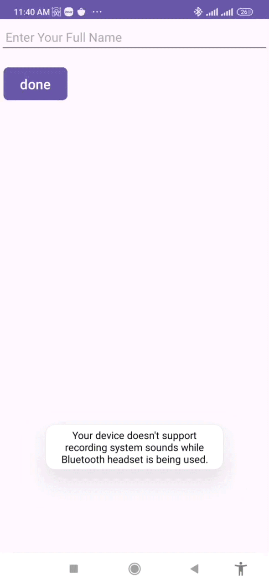

ViewApp
ViewApp is an Android application that demonstrates basic user interaction elements such as Buttons, CheckBoxes, RadioButtons, and TextViews. The app allows users to edit their profile information and displays a profile picture, name, and other details.

Features
- **Edit Profile**: Users can navigate to the profile edit screen and update their full name.
- **Interactive Elements**: The main screen contains CheckBoxes and RadioButtons that trigger Toast messages upon interaction.
- **Profile Picture**: A placeholder profile picture is displayed on the main screen.

Screenshots

 


Installation
To run this project locally, follow these steps:
1. **Clone the repository:**
   ```bash
   git clone https://github.com/yourusername/viewapp.git
   ```
2. **Open the project in Android Studio:**
   - Launch Android Studio.
   - Select `File > Open...` and navigate to the cloned repository.

3. **Build and Run:**
   - Connect an Android device or start an emulator.
   - Click the `Run` button in Android Studio.

 Usage
1. **Main Screen:**
   - The main screen displays the profile picture, name, and several interactive elements.
   - Clicking the "Edit Profile" button navigates to the edit profile screen.
2. **Edit Profile Screen:**
   - Enter a new full name in the input field.
   - Click the "Done" button to save changes and return to the main screen with the updated name.

Code Overview
MainActivity.java
```java
package com.example.viewapp;

import androidx.appcompat.app.AppCompatActivity;
import android.content.Intent;
import android.os.Bundle;
import android.view.View;
import android.widget.Button;
import android.widget.CheckBox;
import android.widget.CompoundButton;
import android.widget.RadioButton;
import android.widget.RadioGroup;
import android.widget.TextView;
import android.widget.Toast;

public class MainActivity extends AppCompatActivity {
    @Override
    protected void onCreate(Bundle savedInstanceState) {
        super.onCreate(savedInstanceState);
        setContentView(R.layout.activity_main);

        Button btneditprofile = findViewById(R.id.btn_main_edit_profile);
        CheckBox checkBox1 = findViewById(R.id.checkBox1);
        CheckBox checkBox2 = findViewById(R.id.checkBox2);
        CheckBox checkBox3 = findViewById(R.id.checkBox3);
        RadioGroup radioGroup = findViewById(R.id.radiogroup);
        RadioButton radioButton1 = findViewById(R.id.radio_main_btn1);
        RadioButton radioButton2 = findViewById(R.id.radio_main_btn2);
        RadioButton radioButton3 = findViewById(R.id.radio_main_btn3);
        TextView txtfullname = findViewById(R.id.txt_main_name);

        btneditprofile.setOnClickListener(new View.OnClickListener() {
            @Override
            public void onClick(View v) {
                Intent intent= new Intent(MainActivity.this, Maineditprofile.class);
                startActivity(intent);
            }
        });

        checkBox1.setOnCheckedChangeListener(new CompoundButton.OnCheckedChangeListener() {
            @Override
            public void onCheckedChanged(CompoundButton buttonView, boolean isChecked) {
                if (isChecked) {
                    Toast.makeText(MainActivity.this, "checkbox1", Toast.LENGTH_LONG).show();
                }
            }
        });

        radioGroup.setOnCheckedChangeListener(new RadioGroup.OnCheckedChangeListener() {
            @Override
            public void onCheckedChanged(RadioGroup group, int checkedId) {
                if (checkedId == R.id.radio_main_btn1) {
                    Toast.makeText(MainActivity.this, "radio1", Toast.LENGTH_LONG).show();
                }
                if (checkedId == R.id.radio_main_btn2) {
                    Toast.makeText(MainActivity.this, "radio2", Toast.LENGTH_LONG).show();
                }
                if (checkedId == R.id.radio_main_btn3) {
                    Toast.makeText(MainActivity.this, "radio3", Toast.LENGTH_LONG).show();
                }
            }
        });

        String txfullname = getIntent().getStringExtra("fullname");
        txtfullname.setText(txfullname);
    }
}
```

### Maineditprofile.java
```java
package com.example.viewapp;
import androidx.appcompat.app.AppCompatActivity;
import android.content.Intent;
import android.os.Bundle;
import android.view.View;
import android.widget.Button;
import android.widget.TextView;

public class Maineditprofile extends AppCompatActivity {
    @Override
    protected void onCreate(Bundle savedInstanceState) {
        super.onCreate(savedInstanceState);
        setContentView(R.layout.activity_maineditprofile);

        Button btndone = findViewById(R.id.btn_editprofile_done);
        TextView txtfullname = findViewById(R.id.fullname);

        btndone.setOnClickListener(new View.OnClickListener() {
            @Override
            public void onClick(View v) {
                String fullname = txtfullname.getText().toString();
                Intent intent = new Intent(Maineditprofile.this, MainActivity.class);
                intent.putExtra("fullname", fullname);
                startActivity(intent);
            }
        });
    }
}
```
Contributing
Contributions are welcome! Please fork the repository and submit a pull request for review.

License
This project is licensed under the MIT License - see the [LICENSE](LICENSE) file for details.


